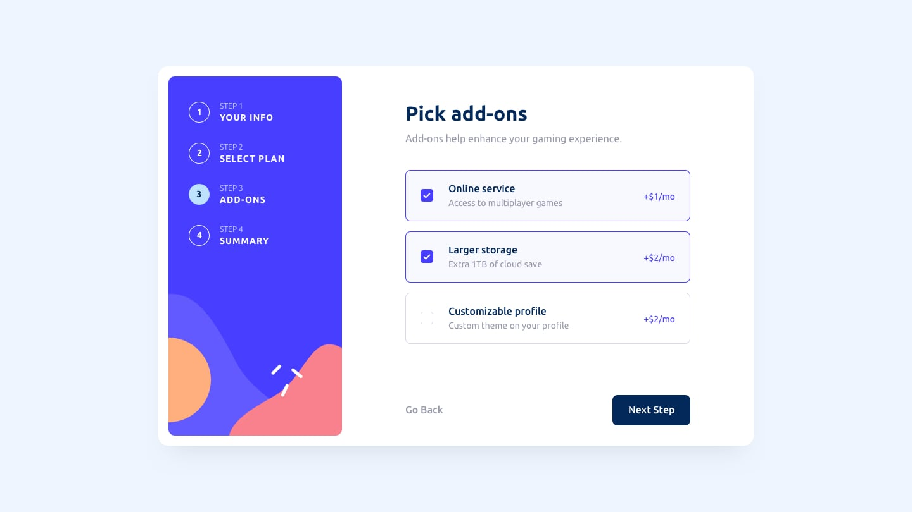

# [React Form Mock](https://react-form-mock.vercel.app)

This is a solution to the [Multi-step form challenge on Frontend Mentor](https://www.frontendmentor.io/challenges/multistep-form-YVAnSdqQBJ). Frontend Mentor challenges help you improve your coding skills by building realistic projects.

## Overview

A persistent multi step form. The reason to pick this project was to practice multi step form management in TypeScript without any form management library and add complete test cases suite.

### The challenge

Users should be able to:

- Complete each step of the sequence
- Go back to a previous step to update their selections
- See a summary of their selections on the final step and confirm their order
- View the optimal layout for the interface depending on their device's screen size
- See hover and focus states for all interactive elements on the page
- Receive form validation messages if:
  - A field has been missed
  - The email address is not formatted correctly
  - A step is submitted, but no selection has been made

### Screenshot

|                    Desktop                   |                    Mobile                      |
|:--------------------------------------------:|:----------------------------------------------:|
|| |

### Links

- The form demo is live at : [Demo](https://react-form-mock.vercel.app)

## My process

### Built with

- React
- TypeScript
- CSS Module
 
- Semantic HTML5 markup
- CSS custom properties
- ES7+
- Flexbox
- Mobile-first workflow

### What I learned

The state management was tricky at first as I was validating each step input at parent component, this resulted int very tightly coupled logic between each step and Parent App component, I initially took this step as I kept footer component in Parent App component and the validations were being triggered on Footer's `handleNext`(fxn to go to next step) function call.

You can checked code for that under branch [parent/validation](https://github.com/dreamer01/react-form-mock/tree/parent/validation)
My previous solution was way too over engineered, just moving the Footer component to each step made the whole state management very easy to work with.

Moving validation for fields to their own step help unclutter the main state, which then turned out be what was required to send over the network to server, no further transformation and cleanup required.

### Continued development

Currently I am satisfied with the result that has come out of this project, got to refresh few concepts with state management and strengthen working with TypeScript while gaining confidence writing test cases.

Maybe I will try to integrate

- Zod : For state objects
- Best practices around writing test cases.

### Useful resources for testing

The official docs of the testing libraries used were very helpful, I didn't had to spend much time learning how to get started with them in my project.

- [Vitest](https://vitest.dev/) : The test runner
- [React Testing Library](https://testing-library.com/docs/react-testing-library/intro/) : For Unit/Integration Test cases
- [MSW](https://mswjs.io/) : API Mocking layer
- [Playwright](https://playwright.dev/): E2E Test cases

## Author

- Website - [Pushpendra Singh](https://stud2design.in/blog)
- Twitter - [@Stud2Design](https://www.twitter.com/Stud2design)
